<p align="center">
  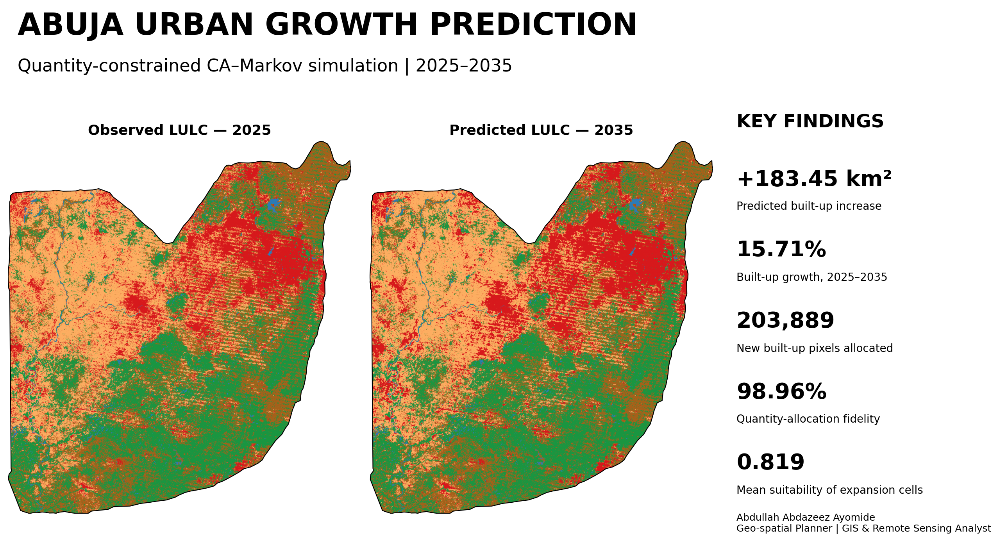
</p>

# Urban Growth Prediction in Abuja Using a Quantity-Constrained CA–Markov Model (2025–2035)

Abuja’s continued expansion requires planners to anticipate where future development pressure may concentrate before infrastructure and environmental systems are overwhelmed. This project combined historical land-use and land-cover information, a **2015–2025 Markov transition matrix**, an urban-expansion suitability surface, and a **quantity-constrained cellular automata allocation** to simulate a spatial planning scenario for 2035.

Built-up land is projected to increase from **1,167.85 km² in 2025 to 1,351.30 km² in 2035**, representing a net increase of **183.45 km² (15.71%)**. Cropland records the largest predicted decline at **153.74 km²**. The allocation selected **203,889 of 206,027 required new built-up pixels**, achieving **98.96% quantity-allocation fidelity**. Allocated expansion cells had a mean suitability score of **0.819**, compared with **0.624** across other finite candidate cells.

Historical simulation validation produced **49.27% overall accuracy** and **0.366 Kappa** using **1,500 samples**. This moderate agreement is reported transparently: the 2035 output should be interpreted as a **planning scenario**, not a deterministic forecast.

| Project detail | Information |
|---|---|
| **Study area** | Federal Capital Territory, Abuja, Nigeria |
| **Historical context** | LULC maps for 2005, 2015 and 2025 |
| **Prediction period** | 2025–2035 |
| **Mapped area** | Approximately 7,351.29 km² |
| **Spatial resolution** | 30 m |
| **Projection** | WGS 84 / UTM Zone 32N (EPSG:32632) |
| **Model** | Quantity-constrained CA–Markov with suitability-based allocation |
| **Land-cover classes** | Built-up, vegetation, cropland, bare land and water |

## Key findings

- Built-up land is projected to expand by **183.45 km²**, increasing by **15.71%** between 2025 and 2035.
- Cropland is projected to decrease by **153.74 km²**, accounting for most of the land converted to new urban development.
- Vegetation declines slightly by **11.00 km²**, while bare land decreases by **18.70 km²**.
- The model allocated **203,889 new built-up pixels**, only **2,138 pixels below** the Markov-derived requirement.
- Expansion cells had substantially higher suitability (**mean 0.819**) than non-expansion candidate cells (**mean 0.624**).
- Historical validation was modest (**49.27% OA; Kappa 0.366**), so the prediction is most useful for strategic scenario comparison and monitoring rather than parcel-level development approval.

## Project maps

<table>
<tr>
<td width="50%">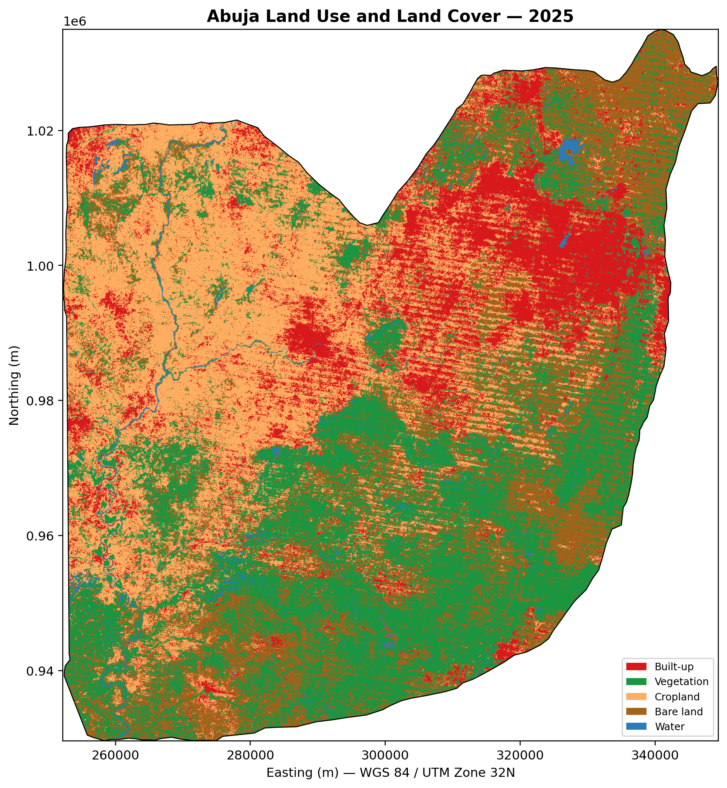<br><b>Baseline land cover, 2025</b></td>
<td width="50%">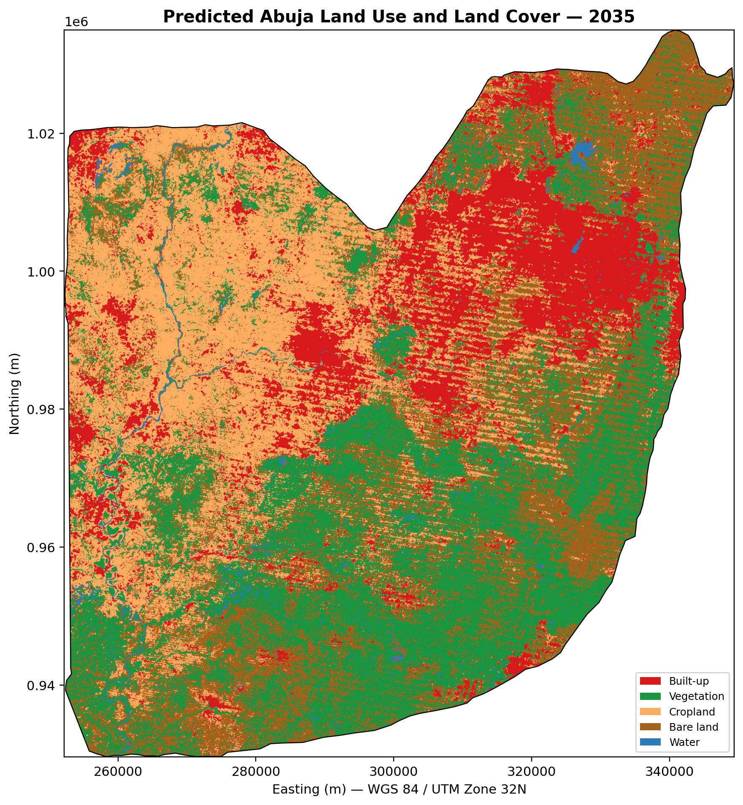<br><b>Predicted land cover, 2035</b></td>
</tr>
<tr>
<td width="50%">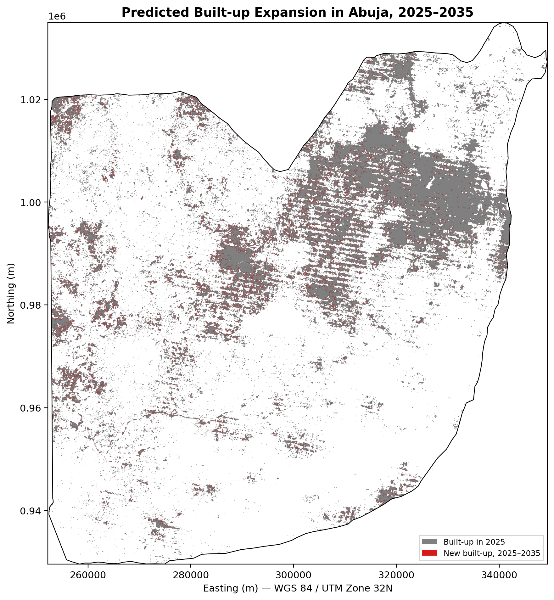<br><b>Predicted built-up expansion</b></td>
<td width="50%">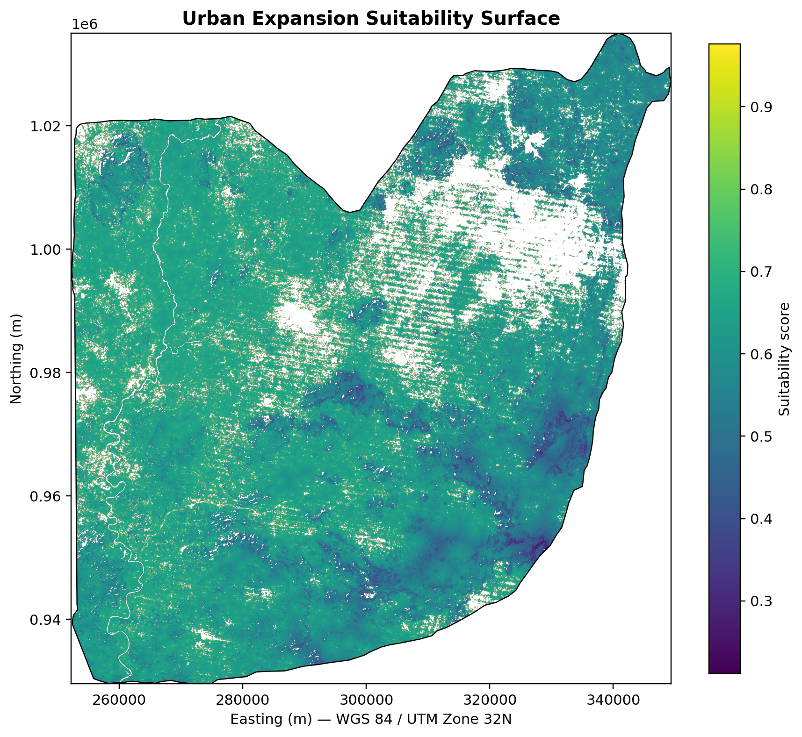<br><b>Urban expansion suitability</b></td>
</tr>
</table>

## Analytical workflow

<p align="center">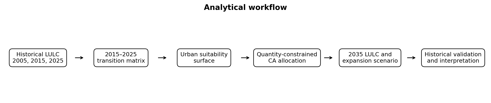</p>

The historical classification workflow used Landsat surface reflectance, QA-based masking, spectral indices, Random Forest ensembles, and stable-label transfer to construct the 2005, 2015 and 2025 land-cover series. The 2015–2025 transitions were converted into Markov probabilities. A suitability surface then ranked plausible expansion locations, while the final CA allocation constrained the number of new built-up pixels to the Markov-derived demand.

The original cloud workflow depended on imported training polygons and Earth Engine assets that were not included in the uploaded final archive. This repository therefore preserves the final geospatial outputs and supplies local scripts that reproduce the maps, charts, tables and validation checks from those outputs.

## Quantitative results

<p align="center">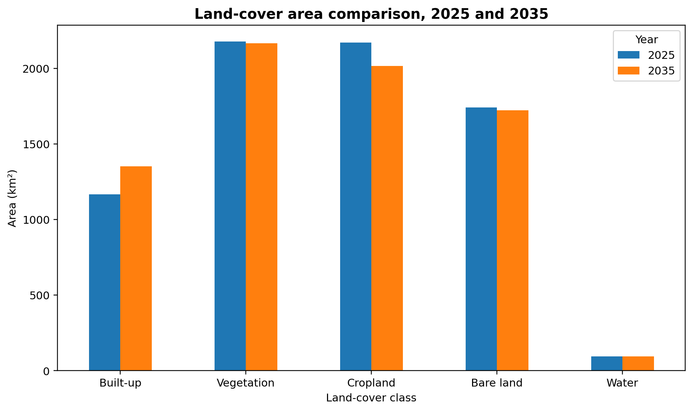</p>
<p align="center">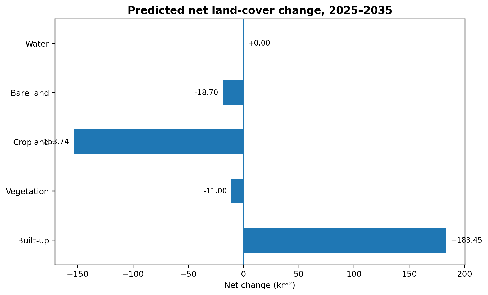</p>

| Class | 2025 area (km²) | 2035 area (km²) | Net change (km²) | Change (%) |
|---|---:|---:|---:|---:|
| Built-up | 1,167.85 | 1,351.30 | +183.45 | +15.71 |
| Vegetation | 2,177.91 | 2,166.91 | -11.00 | -0.51 |
| Cropland | 2,170.11 | 2,016.37 | -153.74 | -7.08 |
| Bare land | 1,741.57 | 1,722.86 | -18.70 | -1.07 |
| Water | 93.86 | 93.86 | +0.00 | +0.00 |


## Transition behaviour and suitability allocation

<p align="center">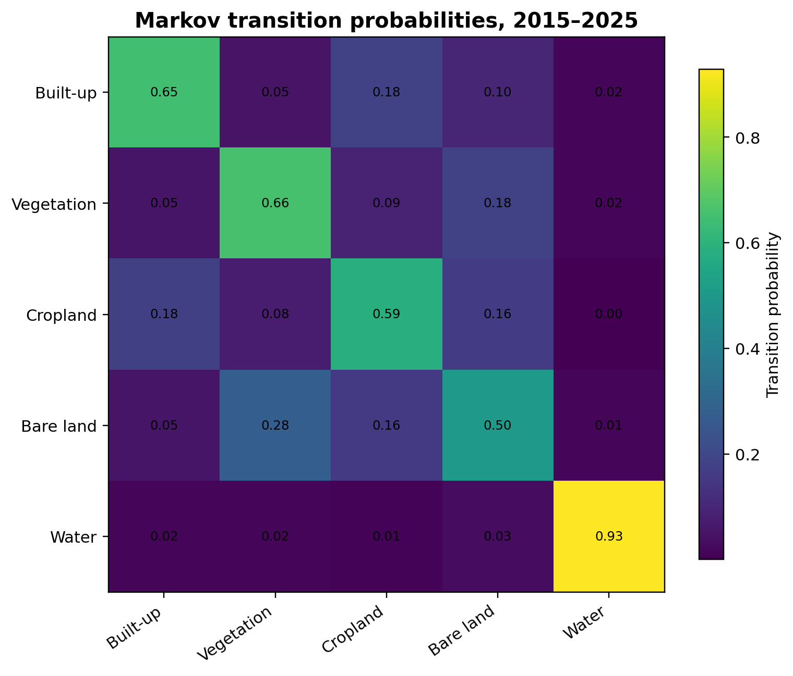</p>
<p align="center">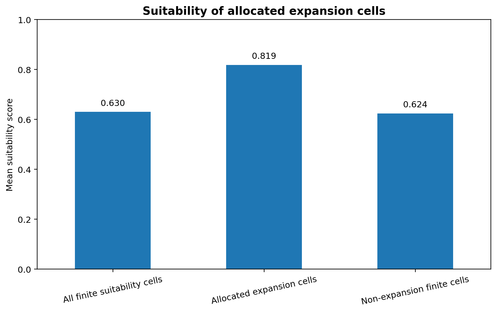</p>

The 2015–2025 Markov matrix indicates high persistence for water (**92.83%**) and moderate persistence for built-up (**64.85%**), vegetation (**65.85%**) and cropland (**58.60%**). Cropland recorded the highest transition probability to built-up land at **17.61%**, providing an important warning for agricultural land protection around Abuja’s expanding urban edge.

## Validation and interpretation

<p align="center">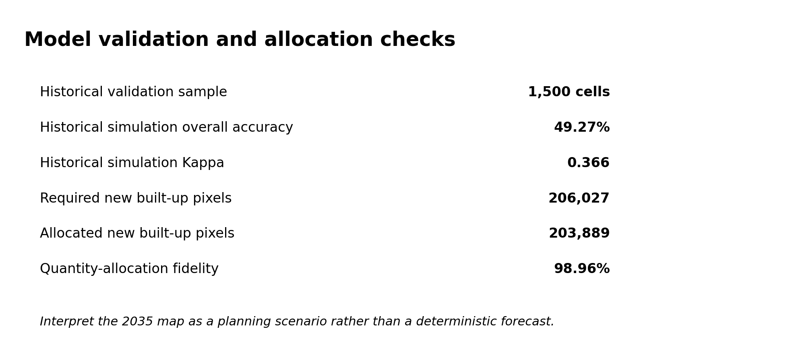</p>

Historical validation compared a simulated 2025 map with observed 2025 LULC. The resulting **49.27% overall accuracy** and **0.366 Kappa** indicate that the historical simulation did not reproduce all observed transitions reliably. The final 2035 scenario improves quantity control by anchoring the allocation to actual 2025 class quantities and matching **98.96%** of the required new built-up pixel demand, but it does not remove spatial uncertainty.

## Planning relevance

The outputs identify areas where urban growth pressure is most likely to intensify under the modelled transition regime. They can support strategic growth-boundary discussions, infrastructure phasing, peri-urban monitoring, agricultural land protection and environmental screening. The suitability and expansion layers are best used to prioritise field verification and compare planning alternatives, not as automatic approval maps.

## Repository contents

```text
.
├── assets/                     # Project cover and social-preview graphic
├── data/processed/             # Final rasters, tables and FCT boundary
├── docs/                       # Data, methodology, results and limitations
├── notebooks/                  # Results-review notebook
├── outputs/maps/               # Publication-ready maps
├── outputs/charts/             # Workflow and analytical figures
├── outputs/tables/             # Cleaned summaries and derived statistics
├── scripts/gee/                # Earth Engine workflow documentation
├── scripts/python/             # Local figure and result-reproduction scripts
├── reports/                    # Concise technical summary
└── validation/                 # Repository validation outputs
```

## Reproducibility

1. Install the listed dependencies with `pip install -r requirements.txt`.
2. Run `python scripts/python/reproduce_summary.py` to verify the supplied tables and raster properties.
3. Run `python scripts/python/generate_repository_outputs.py` to regenerate the main project maps and charts.
4. Review [`docs/METHODOLOGY.md`](docs/METHODOLOGY.md) and [`docs/LIMITATIONS.md`](docs/LIMITATIONS.md) before interpreting the scenario.
5. The original Earth Engine workflow requires the 2025 reference polygons and cloud assets described in [`scripts/gee/README.md`](scripts/gee/README.md).

## Author

**Abdullah Abdazeez Ayomide**  
Geo-spatial Planner | GIS & Remote Sensing Analyst

- [GitHub](https://github.com/Abdullahabdazeez)
- [LinkedIn](https://ng.linkedin.com/in/abdazeez-abdullah-4b814719a)
- [Email](mailto:abdazeezabdullah1@gmail.com)

## Citation and licence

Citation metadata is provided in [`CITATION.cff`](CITATION.cff). Code is released under the MIT License. Landsat, administrative and other external data remain subject to their providers’ terms.
